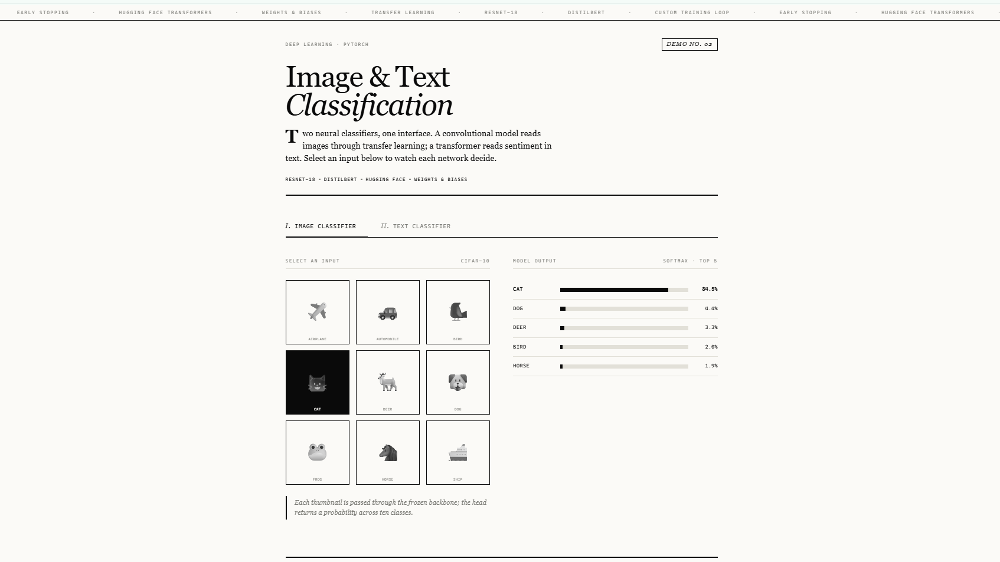
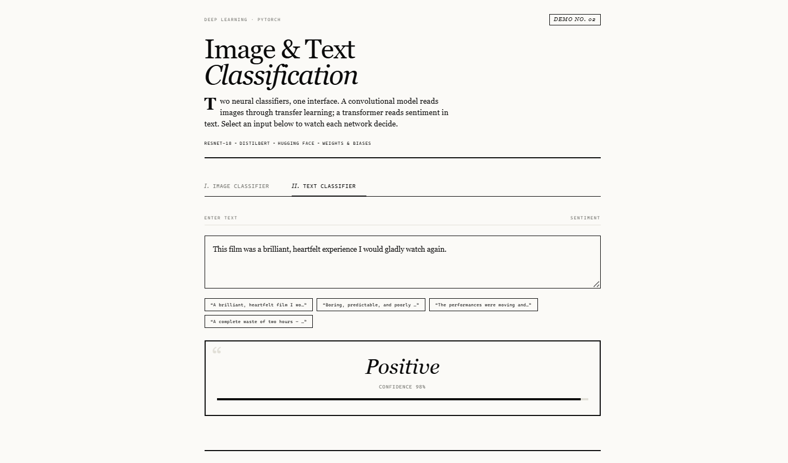

# Deep Learning: Image & Text Classification

Two deep-learning classifiers built with PyTorch — an **image classifier** using
transfer learning on a pretrained CNN, and a **text classifier** built by fine-tuning
a Hugging Face Transformer. Both use custom PyTorch training loops with experiment
tracking via Weights & Biases.


## 🔗 Live Demo

**[▶ Try the interactive demo](https://saikarna60.github.io/deep-learning-classification/)**

Pick an image to see the CNN's softmax output, or type a sentence to watch the
transformer classify its sentiment in real time.





## Overview

| Task | Model | Technique |
|------|-------|-----------|
| Image classification | ResNet18 (pretrained) | Transfer learning, frozen backbone, custom head |
| Text classification | DistilBERT | Transformer fine-tuning for sentiment |

Both scripts implement a **custom training loop** covering forward propagation,
loss calculation, backpropagation, validation, and model checkpointing — plus
data augmentation, dropout, and early stopping on the image side.

## Tech Stack

- **Frameworks:** PyTorch, torchvision, Hugging Face Transformers
- **Experiment tracking:** Weights & Biases
- **Techniques:** transfer learning, data augmentation, early stopping, checkpointing

## Project Structure

```
deep-learning-classification/
├── config.py              # Device, paths, hyperparameters
├── image_classifier.py    # ResNet18 transfer learning (CIFAR-10)
├── text_classifier.py     # DistilBERT fine-tuning (sentiment)
├── tracking.py            # Optional Weights & Biases logging
├── requirements.txt
└── README.md
```

## Quickstart

### Install

```bash
pip install -r requirements.txt
```

### Train the image classifier

```bash
python image_classifier.py
```

Downloads CIFAR-10, applies augmentation, and trains a transfer-learning head on top
of a frozen ResNet18 backbone with early stopping and checkpointing.

### Train the text classifier

```bash
python text_classifier.py
```

Fine-tunes DistilBERT on a small sentiment dataset and runs a demo prediction.

### Enable experiment tracking (optional)

```bash
USE_WANDB=1 python image_classifier.py
```

## Key Techniques

- **Transfer learning** — a pretrained ResNet18 backbone is frozen and only a new
  classification head is trained, which is fast and effective on limited data.
- **Custom training loop** — explicit forward pass, loss, `backward()`, and optimizer
  step, rather than a high-level trainer, for full control and clarity.
- **Regularization** — data augmentation (random crop/flip) and early stopping to
  reduce overfitting.
- **Transformer fine-tuning** — DistilBERT with a sequence-classification head, tokenized
  with the Hugging Face `AutoTokenizer`.

## License

MIT
